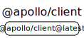

# 源码分析

## 文件结构

``` bash
/Users/liufang/openSource/FunnyLiu/apollo-client
├── config
|  ├── entryPoints.js
|  ├── helpers.ts
|  ├── jest.config.js
|  ├── prepareDist.js
|  ├── processInvariants.ts
|  ├── resolveModuleIds.ts
|  ├── rewriteSourceMaps.ts
|  ├── rollup.config.js
|  ├── tsconfig.json
|  └── version.js
├── src
|  ├── cache
|  |  ├── core
|  |  |  ├── cache.ts
|  |  |  └── types
|  |  |     ├── Cache.ts
|  |  |     ├── DataProxy.ts
|  |  |     └── common.ts
|  |  ├── index.ts
|  |  └── inmemory
|  |     ├── entityStore.ts
|  |     ├── fixPolyfills.native.ts
|  |     ├── fixPolyfills.ts
|  |     ├── helpers.ts
|  |     ├── inMemoryCache.ts
|  |     ├── policies.ts
|  |     ├── reactiveVars.ts
|  |     ├── readFromStore.ts
|  |     ├── types.ts
|  |     └── writeToStore.ts
|  ├── config
|  |  └── jest
|  |     └── setup.ts
|  ├── core
|  |  ├── ApolloClient.ts
|  |  ├── LocalState.ts
|  |  ├── ObservableQuery.ts
|  |  ├── QueryInfo.ts
|  |  ├── QueryManager.ts
|  |  ├── Reobserver.ts
|  |  ├── index.ts
|  |  ├── networkStatus.ts
|  |  ├── types.ts
|  |  └── watchQueryOptions.ts
|  ├── errors
|  |  ├── __tests__
|  |  |  └── ApolloError.ts
|  |  └── index.ts
|  ├── index.ts
|  ├── link
|  |  ├── batch
|  |  |  ├── __tests__
|  |  |  |  └── batchLink.ts
|  |  |  ├── batchLink.ts
|  |  |  ├── batching.ts
|  |  |  └── index.ts
|  |  ├── batch-http
|  |  |  ├── __tests__
|  |  |  |  └── batchHttpLink.ts
|  |  |  ├── batchHttpLink.ts
|  |  |  └── index.ts
|  |  ├── context
|  |  |  ├── __tests__
|  |  |  |  └── index.ts
|  |  |  └── index.ts
|  |  ├── core
|  |  |  ├── ApolloLink.ts
|  |  |  ├── __tests__
|  |  |  |  └── ApolloLink.ts
|  |  |  ├── concat.ts
|  |  |  ├── empty.ts
|  |  |  ├── execute.ts
|  |  |  ├── from.ts
|  |  |  ├── index.ts
|  |  |  ├── split.ts
|  |  |  └── types.ts
|  |  ├── error
|  |  |  ├── __tests__
|  |  |  |  └── index.ts
|  |  |  └── index.ts
|  |  ├── http
|  |  |  ├── HttpLink.ts
|  |  |  ├── checkFetcher.ts
|  |  |  ├── createHttpLink.ts - 基于fetch api来完成接口发送的封装
|  |  |  ├── createSignalIfSupported.ts
|  |  |  ├── index.ts
|  |  |  ├── parseAndCheckHttpResponse.ts
|  |  |  ├── rewriteURIForGET.ts
|  |  |  ├── selectHttpOptionsAndBody.ts
|  |  |  ├── selectURI.ts
|  |  |  └── serializeFetchParameter.ts
|  |  ├── persisted-queries
|  |  |  └── index.ts
|  |  ├── retry
|  |  |  ├── delayFunction.ts
|  |  |  ├── index.ts
|  |  |  ├── retryFunction.ts
|  |  |  └── retryLink.ts
|  |  ├── schema
|  |  |  └── index.ts
|  |  ├── utils
|  |  |  ├── createOperation.ts
|  |  |  ├── fromError.ts
|  |  |  ├── fromPromise.ts
|  |  |  ├── index.ts
|  |  |  ├── throwServerError.ts
|  |  |  ├── toPromise.ts
|  |  |  ├── transformOperation.ts
|  |  |  └── validateOperation.ts
|  |  └── ws
|  |     └── index.ts
|  ├── react
|  |  ├── components
|  |  |  ├── Mutation.tsx
|  |  |  ├── Query.tsx
|  |  |  ├── Subscription.tsx
|  |  |  ├── index.ts
|  |  |  └── types.ts
|  |  ├── context
|  |  |  ├── ApolloConsumer.tsx
|  |  |  ├── ApolloContext.ts - getApolloContext()方法，给子组件获取client上下文
|  |  |  ├── ApolloProvider.tsx - consumer的实现，给子组件传上下文，将client传递
|  |  |  └── index.ts
|  |  ├── data
|  |  |  ├── MutationData.ts
|  |  |  ├── OperationData.ts
|  |  |  ├── QueryData.ts
|  |  |  ├── SubscriptionData.ts
|  |  |  └── index.ts
|  |  ├── hoc
|  |  |  ├── graphql.tsx
|  |  |  ├── hoc-utils.tsx
|  |  |  ├── index.ts
|  |  |  ├── mutation-hoc.tsx
|  |  |  ├── query-hoc.tsx
|  |  |  ├── subscription-hoc.tsx
|  |  |  ├── types.ts
|  |  |  └── withApollo.tsx
|  |  ├── hooks
|  |  |  ├── index.ts
|  |  |  ├── useApolloClient.ts
|  |  |  ├── useLazyQuery.ts
|  |  |  ├── useMutation.ts
|  |  |  ├── useQuery.ts - useQuery的实现，基于useBaseQuery.ts
|  |  |  ├── useReactiveVar.ts
|  |  |  ├── useSubscription.ts
|  |  |  └── utils
|  |  |     ├── useBaseQuery.ts
|  |  |     └── useDeepMemo.ts
|  |  ├── index.ts
|  |  ├── parser
|  |  |  └── index.ts
|  |  ├── ssr
|  |  |  ├── RenderPromises.ts
|  |  |  ├── getDataFromTree.ts
|  |  |  ├── index.ts
|  |  |  └── renderToStringWithData.ts
|  |  └── types
|  |     └── types.ts
|  ├── testing
|  |  └── index.ts
|  ├── utilities
|  |  ├── common
|  |  |  ├── arrays.ts
|  |  |  ├── canUse.ts
|  |  |  ├── cloneDeep.ts
|  |  |  ├── compact.ts
|  |  |  ├── environment.ts
|  |  |  ├── errorHandling.ts
|  |  |  ├── filterInPlace.ts
|  |  |  ├── maybeDeepFreeze.ts
|  |  |  └── mergeDeep.ts
|  |  ├── graphql
|  |  |  ├── __tests__
|  |  |  |  ├── directives.ts
|  |  |  |  ├── fragments.ts
|  |  |  |  ├── getFromAST.ts
|  |  |  |  ├── storeUtils.ts
|  |  |  |  └── transform.ts
|  |  |  ├── directives.ts
|  |  |  ├── fragments.ts
|  |  |  ├── getFromAST.ts
|  |  |  ├── storeUtils.ts
|  |  |  └── transform.ts
|  |  ├── index.ts
|  |  ├── observables
|  |  |  ├── Concast.ts
|  |  |  ├── Observable.ts
|  |  |  ├── asyncMap.ts
|  |  |  └── iteration.ts
|  |  ├── policies
|  |  |  ├── __tests__
|  |  |  |  └── relayStylePagination.test.ts
|  |  |  └── pagination.ts
|  |  └── testing
|  |     ├── __tests__
|  |     |  └── stripSymbols.ts
|  |     ├── index.ts
|  |     ├── itAsync.ts
|  |     ├── mocking
|  |     |  ├── MockedProvider.tsx
|  |     |  ├── __tests__
|  |     |  |  ├── MockedProvider.test.tsx
|  |     |  |  ├── __snapshots__
|  |     |  |  |  └── MockedProvider.test.tsx.snap
|  |     |  |  └── mockSubscriptionLink.test.tsx
|  |     |  ├── mockClient.ts
|  |     |  ├── mockFetch.ts
|  |     |  ├── mockLink.ts
|  |     |  ├── mockQueryManager.ts
|  |     |  ├── mockSubscriptionLink.ts
|  |     |  └── mockWatchQuery.ts
|  |     ├── observableToPromise.ts
|  |     ├── stripSymbols.ts
|  |     ├── subscribeAndCount.ts
|  |     └── wrap.ts
|  └── version.ts
└── tsconfig.json

directory: 142 file: 443

ignored

```

## 外部模块依赖




- [graphql-tag源码分析](https://github.com/FunnyLiu/graphql-tag/tree/readsource) - gql函数基于此包实现


## 内部模块依赖


## 知识点

### provider和context

初始化后，通过ApolloProvider传递上下文：

``` js
// Initialize ApolloClient
const client: ApolloClient<NormalizedCacheObject> = new ApolloClient({
  cache,
  uri: "http://localhost:4000/graphql",
  headers: {
    authorization: localStorage.getItem('token') || '',
  },
  typeDefs
});

injectStyles();

// Pass the ApolloClient instance to the ApolloProvider component
ReactDOM.render(
  //将client注入，子组件通过useApolloClient来拿上下文
    <ApolloProvider client={client}>
      <IsLoggedIn />
    </ApolloProvider>,
    document.getElementById('root')
  );

```
然后各个子组件通过useApolloClient来取到上下文：

``` js

const LogoutButton = () => {
  // 从provider拿上下文
  const client = useApolloClient();
  return (
    <StyledButton
      data-testid="logout-button"

      onClick={() => {
        // Evict and garbage-collect the cached user object
        client.cache.evict({ fieldName: 'me' });
        client.cache.gc();
        // Remove user details from localStorage
        localStorage.removeItem('token');
        localStorage.removeItem('userId');
        // Set the logged-in status to false
        isLoggedInVar(false);
      }}
    >
      <ExitIcon />
      Logout
    </StyledButton>
  );
}
```


### @client走客户端

客户端在用的时候通过@client指令来使得查询停留在客户端：

``` js
//@client告诉不要从服务端，而是从客户端拿数据
//在这个项目里也就是cache的值
const IS_LOGGED_IN = gql`
  query IsUserLoggedIn {
    isLoggedIn @client
  }
`;
```


具体的判断逻辑在[此处](https://github.com/FunnyLiu/apollo-client/blob/readsource/src/core/QueryManager.ts#L715)。


### gql函数

凭借graph风格的dsl用，比如以下这种

``` js
export const typeDefs = gql`
  extend type Query {
    isLoggedIn: Boolean!
    cartItems: [ID!]!
  }
`;
//@client告诉不要从服务端，而是从客户端拿数据
//在这个项目里也就是cache的值
const IS_LOGGED_IN = gql`
  query IsUserLoggedIn {
    isLoggedIn @client
  }
`;

```

从graphql-tag[源码分析](https://github.com/FunnyLiu/graphql-tag/tree/readsource)，这个包，导出gql函数。

最后其中是通过[graphql-js的parser来完成解析](https://github.com/FunnyLiu/graphql-js/blob/readsource/src/language/parser.js#L116)


具体逻辑在[此处](https://github.com/FunnyLiu/apollo-client/blob/readsource/src/core/index.ts#L113)


### useQuery

首先理解官方api：[Queries - Client (React) - Apollo GraphQL Docs](https://www.apollographql.com/docs/react/data/queries/#prerequisites)

其实现在[笔记内容](https://github.com/FunnyLiu/apollo-client/blob/readsource/src/react/hooks/useQuery.ts#L8)。

用法一般如下：

``` js
export const GET_LAUNCHES = gql`
  query GetLaunchList($after: String) {
    launches(after: $after) {
      cursor
      hasMore
      launches {
        ...LaunchTile
      }
    }
  }
  ${LAUNCH_TILE_DATA}
`;

const Launches: React.FC<LaunchesProps> = () => {
  // 获取列表
  const { data, loading, error, fetchMore } = useQuery<
    GetLaunchListTypes.GetLaunchList,
    GetLaunchListTypes.GetLaunchListVariables
  >(GET_LAUNCHES);
  const [isLoadingMore, setIsLoadingMore] = useState(false);
  if (loading) return <Loading />;
  if (error) return <p>ERROR</p>;
  if (!data) return <p>Not found</p>;

  return (
    <Fragment>
      <Header />
      {data.launches &&
        data.launches.launches &&
        data.launches.launches.map((launch: any) => (
          <LaunchTile key={launch.id} launch={launch} />
        ))}
      {data.launches &&
        data.launches.hasMore &&
        (isLoadingMore ? (
          <Loading />
        ) : (
          <Button
            onClick={async () => {
              setIsLoadingMore(true);
              // 再次请求
              await fetchMore({
                variables: {
                  after: data.launches.cursor,
                },
              });
              setIsLoadingMore(false);
            }}
          >
            Load More
          </Button>
        ))}
    </Fragment>
  );
};

```


### 最底层到底是怎么发送请求的

见[此处](https://github.com/FunnyLiu/apollo-client/blob/readsource/src/link/http/createHttpLink.ts#L36)。

最后是通过window上的fetch API来完成接口的发送，前面经历了一些列的DSL解析。


-----


# <a href="https://www.apollographql.com/"></a>

## Apollo Client

[](https://badge.fury.io/js/%40apollo%2Fclient)
[](https://circleci.com/gh/apollographql/apollo-client)
[](https://spectrum.chat/apollo)

Apollo Client is a fully-featured caching GraphQL client with integrations for React, Angular, and more. It allows you to easily build UI components that fetch data via GraphQL.

## Documentation

All Apollo Client documentation, including React integration articles and helpful recipes, can be found at: <br/>
[https://www.apollographql.com/docs/react/](https://www.apollographql.com/docs/react/)

The Apollo Client API reference can be found at: <br/>
[https://www.apollographql.com/docs/react/api/apollo-client/](https://www.apollographql.com/docs/react/api/apollo-client/)

## Maintainers

- [@benjamn](https://github.com/benjamn) (Apollo)
- [@hwillson](https://github.com/hwillson) (Apollo)
